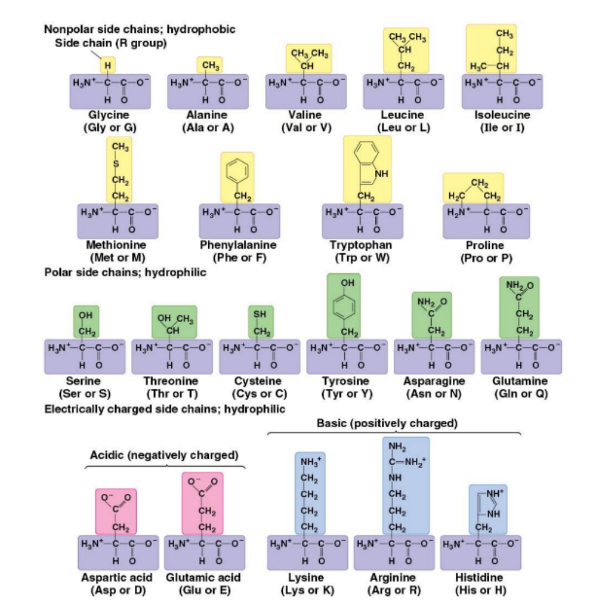

TARGET DECK
Biology::Amino Acids

Trp::UGG
<!--ID: 1716201170818-->

UGG::Trp
<!--ID: 1716201170826-->

UAA::Stop
<!--ID: 1716201170834-->

UGA::Stop
<!--ID: 1716201170841-->

UAG::Stop
<!--ID: 1716201170848-->

Stop::UAA, UAG, UGA
<!--ID: 1716201170856-->

Met::AUG
<!--ID: 1716201170861-->

AUG::Met
<!--ID: 1716201170869-->

UUU::Phe
<!--ID: 1716201198601-->

Phe::UUU
<!--ID: 1716201198617-->

아미노산 표(구조, 3글자 및 1글자 약어)::
<!--ID: 1717589319248-->
