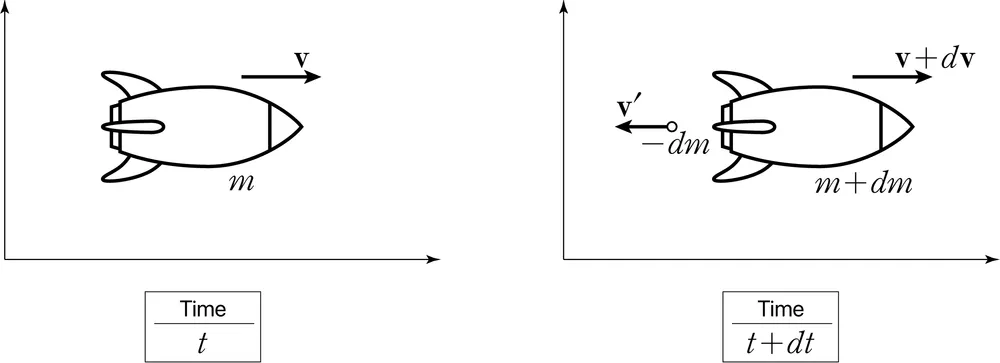

TARGET DECK
Physics::증명

### 로켓 방정식 유도
로켓 방정식을 유도하여라::$$\begin{align} & v_{f}​=v_{i}​+uln\left( \frac{m_{i}}{m_{f}}​ \right) \\ & ma=Rv_{rel} \\ & \text{시각 } t \text{에서 질량이 } m \text{인 로켓의 속도를 } v \text{라 하자. 시각 } t + dt \text{에서 연료가 분출된 후 로켓의 질량이 } m + dm \text{(단, 질량이 줄어드는 상황이므로 } dm < 0\text{)으로 변했다면, 분출된 연료의 질량은 } -dm \text{이 된다. 연료의 분출 속도를 } v' \text{이라 하자. 또, 로켓의 속도는 } v + dv \text{로 변할 것이다.} \\ & \text{이상에서 } t \text{에서 로켓의 계의 운동량은 } mv \text{이고, } t+dt \text{에서 로켓의 운동량은 } (m+dm)(v+dv) \text{, 연료의 운동량은 } -v' \, dm \text{이다. 이는 곧 } t+dt \text{에서 로켓의 계의 운동량은} \\ & (m+dm)(v+dv) - v' \, dm \\ & \text{로켓의 계에 가해지는 외력이 없으므로 계의 운동량은 보존되어야 한다. 즉, } t, t+dt \text{에서 운동량은 같아야 하므로} \\ & mv = (m+dm)(v+dv) - v' \, dm \\ & \text{한편, 연료의 로켓에 대한 상대적인 분출 속도 } -u \equiv v' - (v+dv) \text{를 도입하면,} \\ & mv = (m+dm)(v+dv) + dm[u - (v+dv)] \\ & \text{이것을 전개하여 정리하자.} \\ & m \, dv = -u \, dm \quad (\ast) \\ & \text{변수분리를 통해 위 미분 방정식을 풀 수 있으며} \\ & dv = -\frac{u}{m} \, dm \\ & \text{에서 로켓의 초기 속도를 } v_i, \text{나중 속도를 } v_f, \text{초기 질량을 } m_i, \text{나중 질량을 } m_f \text{라 하면,} \\ & \int_{v_i}^{v_f} dv = -u \int_{m_i}^{m_f} \frac{dm}{m} \\ & \text{인데 아래와 같이 적분의 결과를 나중 속도에 대하여 정리하면,} \\ & v_f = v_i + u \ln \left(\frac{m_f}{m_i}\right) \\ & \text{참고로 식 } (\ast) \text{의 양변을 } dt \text{로 나누면} \\ & m \frac{dv}{dt} = -u \frac{dm}{dt} \end{align}$$
<!--ID: 1716212253202-->

